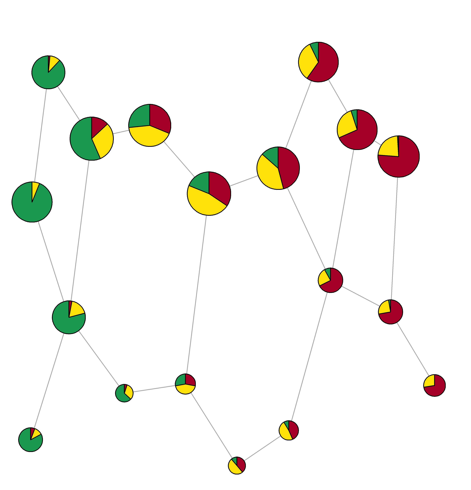
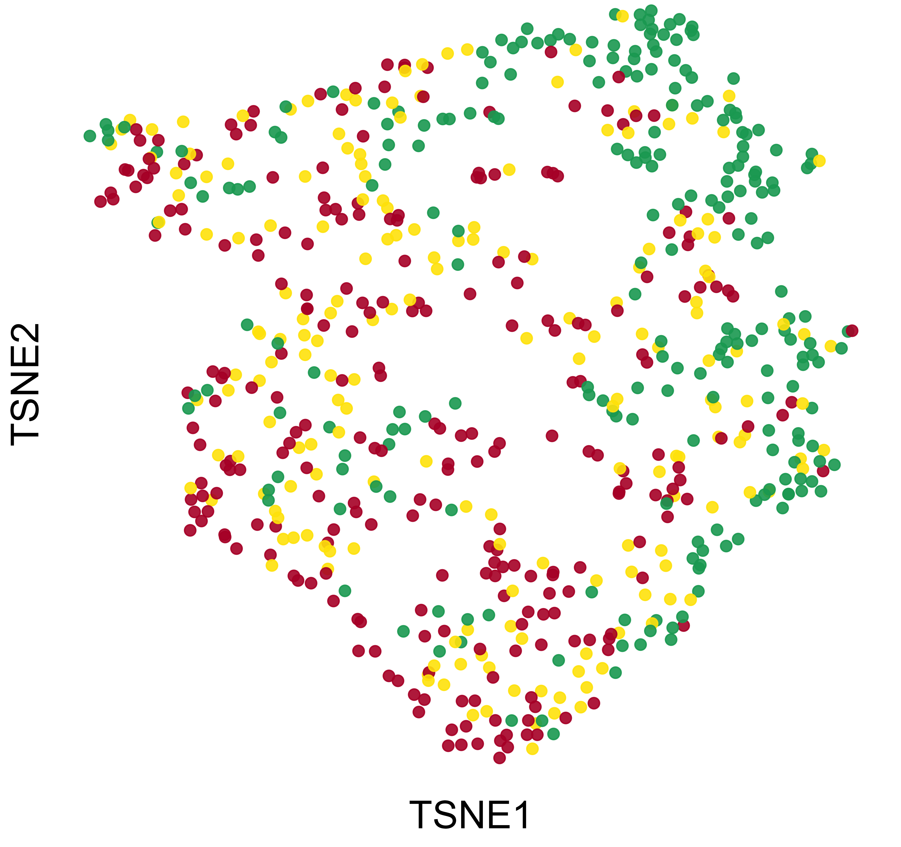

# MAPLE: Mapper Based Localized Prediction with Data Driven Cover Selection for High dimensional Data

## Overview

MAPLE (Mapper-Based Adaptive Prediction via Local Estimation) is a prediction framework built upon the Mapper algorithm from Topological Data Analysis (TDA). The proposed method extends Mapper beyond exploratory data analysis by introducing a statistically principled framework for localized prediction with data-driven cover selection.

The framework estimates conditional class probabilities using graph-induced neighborhoods defined by the connectivity structure of the Mapper graph. MAPLE accommodates ordinal, nominal, and binary outcomes while providing theoretical guarantees, including pointwise consistency and Bayes-risk consistency.

## Key Features

- Mapper-based localized prediction through graph-induced neighborhoods.
- Data-driven cover selection based on a bias–variance trade-off with optimal asymptotic scaling.
- Localized estimation of conditional class probabilities using graph-based neighborhoods.
- Supports
  - Ordinal outcomes (O-MAPLE)
  - Nominal outcomes (M-MAPLE)
  - Binary outcomes
- Permutation-based variable importance for assessing predictor contributions.
- Theoretical guarantees, including
  - Pointwise consistency
  - Bayes-risk consistency
- Applicable to high-dimensional and heterogeneous data with complex geometric structure.

## Method Overview

Consider independent observations $(x_i,y_i),\; i=1,\ldots,n,\;$ where

- $x_i\in\mathbb{R}^p$ is a $p$-dimensional predictor vector,
- $y_i\in\{1,\ldots,R\}$ is an ordinal response with $R$ ordered classes.

MAPLE first constructs a one-dimensional filter $T=f(X),$ using Ordinal Accelerated Sparse Discriminant Analysis (OASDA). The objective is to estimate the conditional class probabilities

$$
\eta_r(t)=P(Y=r\mid T=t),
\qquad r=1,\ldots,R,
$$

which is estimated through localized neighborhoods induced by the Mapper graph.

---

### Mapper Construction

The Mapper graph is constructed from the one-dimensional filter values by

- partitioning the filter into overlapping intervals,
- performing hierarchical clustering (Ward's method) within each interval,
- creating a graph whose nodes represent clusters and whose edges connect clusters sharing common observations.

The resulting Mapper graph captures the local connectivity and global geometric structure of the predictor space.

### Data-Driven Cover Selection

MAPLE selects the interval cover by minimizing the bias–variance criterion

$$
L(S,l)=\rho S^{-1}+(1-\rho)l^{-4},
\qquad
0<\rho<1,
$$

subject to

$$
S+(l-1)q=n,
\qquad
\frac{S}{2}\le q\le S.
$$

The resulting optimal scaling is

- Number of intervals: $l^\ast=\left(\frac{8n(1-\rho)}{\rho}\right)^{1/5}$

- Observations per interval: $S^\ast=\frac{2n}{l^\ast+1}$

- Shift between consecutive intervals: $q^\ast=\frac{n}{l^\ast+1}$

yielding an optimal overlap ratio $\frac{q^\ast}{S^\ast}=\frac{1}{2}$.

The tuning parameter $\rho$ is selected by cross-validation.

---

### Localized Prediction

For a new observation $x_{\mathrm{new}}$, MAPLE computes its filter value $t_{\mathrm{new}}=f(x_{\mathrm{new}})$, identifies the corresponding Mapper interval(s), assigns the observation to the nearest Mapper cluster, and constructs a localized graph neighborhood. The conditional class probabilities are estimated by

$$
\hat{\eta}_r(t_{\mathrm{new}})=\sum_{i=1}^{m}\tilde{w}_i\,\mathbf{1}(y_i=r),\quad r=1,\ldots,R.
$$

where the normalized inverse-squared distance weights are $`\tilde{w}_i=\frac{\|u_i-x_{\mathrm{new}}\|^{-2}}
{\sum_{j=1}^{m}\|u_j-x_{\mathrm{new}}\|^{-2}}`$

For ordinal outcomes, the cumulative estimated probabilities are $\hat{F}(r\mid t_{\mathrm{new}})=\sum_{s=1}^{r}\hat{\eta}_s(t_{\mathrm{new}}),$ and the predicted class is obtained using the posterior median rule $\hat{y}(x_{\mathrm{new}})=\inf\{\,r:\hat{F}(r\mid t_{\mathrm{new}})\ge\tfrac12\,\},$ which defines **Ordinal MAPLE (O-MAPLE)**.

For nominal outcomes, the predicted class is $\hat{y}(x_{\mathrm{new}})=\arg\max_{1\le r\le R}\hat{\eta}_r(t_{\mathrm{new}}),$ which defines **Multinomial MAPLE (M-MAPLE)**.

---

## Repository Structure

``` text
.
├── Simulation Study/
├── Real Data Analysis/
│   ├── PPMI
│   └── UCSC Xena
├── Images/
└── README.md
```

## Simulation Study

MAPLE is evaluated under a range of simulated settings including

- Nonlinear branching structures
- Heterogeneous predictor-response relationships
- Skewed covariate distributions
- Correlated predictors
- Varying noise levels
- Varying sample sizes (250, 500, 1000)
- Performance is evaluated using
  - Quadratic Weighted Kappa (QWK)
  - Concordance Index (C-index)

## Applications

### 1. Parkinson’s Disease (PPMI)

Prediction of the **Hoehn–Yahr stage** using baseline clinical and biomarker data from the Parkinson's Progression Markers Initiative (PPMI).

<table align="center" width="100%">
<tr>
<td align="center" width="50%">
<br>
<b>Mapper Plot</b>
</td>

<td align="center" width="50%">
<br>
<b>t-SNE Plot</b>
</td>
</tr>
</table>

The Mapper graph reveals localized disease structure while preserving the connectivity among patient subgroups, providing a more informative representation than conventional low-dimensional visualization.

---

### 2. TCGA Glioma (UCSC Xena)

Prediction of **glioma tumor grade** using high-dimensional RNA sequencing data from The Cancer Genome Atlas (TCGA) accessed through the UCSC Xena platform.

<p align="center">
  
</p>

The resulting Mapper graph summarizes the topological organization of the transcriptomic data, highlighting clinically meaningful patient subgroups with distinct tumor grades and survival characteristics.

## Requirements

- R (recommended)

---

## Contact

**Md Moinul Ahsan**\
*Virginia Commonwealth University*\
📧 Email: [ahsanm8\@vcu.edu](mailto:ahsanm8@vcu.edu)

---

## Keywords

Topological data analysis, Mapper algorithm, localized prediction, nonparametric classification, Parkinson’s disease, Glioma RNA sequencing, Heterogeneous data structures, High-Dimensional Data
